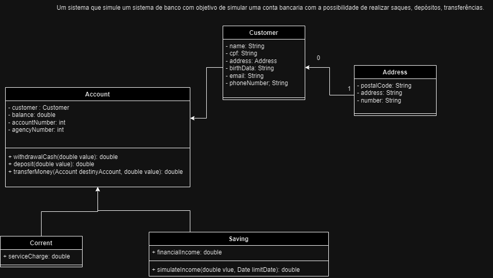

# Zup Bank

- Como podemos fazer com que apenas a classe Account **NÃO GERE OBJETOS**?
R: Podemos fazer isso usando classes abstratas. Classes abstratas não instanciam objetos. Apenas seus filhos através de heranças podem criar objetos 